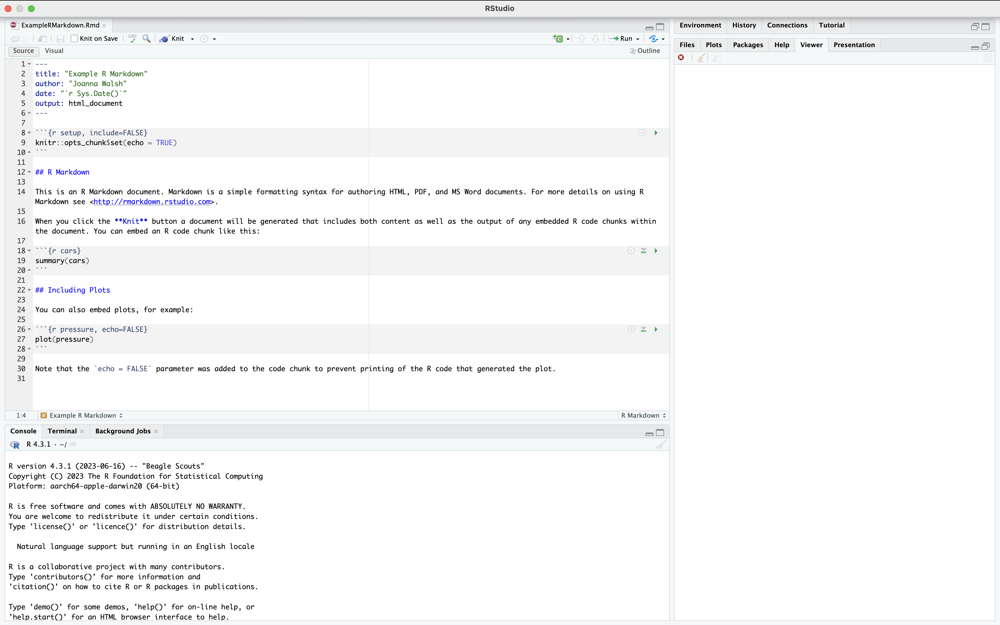
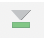
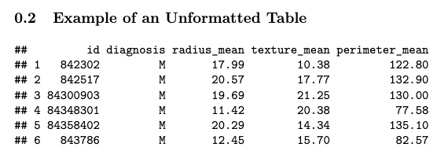

# 12. Writing Reports with R Markdown

This chapter will introduce you to R Markdown, which is a method of making polished reports to present your analyses.

## Creating an R Markdown file

To create an R Markdown file, you will need to have RStudio installed as an application. First, you'll want to install the **rmarkdown** package in addition to the **knitr** package by entering the following code into the RStudio console: `install.packages("rmarkdown", "knitr")`

Now that you have these packages downloaded, opening a new R Markdown file is very similar to opening a new R file, which was covered in Chapter 1. Just like opening a new R file, you'll want to go to File -> New File, but instead of selecting 'R Script', you'll now select 'R Markdown...'. This should bring up a window that looks like the following:


First, enter a title of your choosing for your report and type your name in the Author field - note that you can always change these later - and then click on OK. This will open an R Markdown file that has the extension .Rmd. Make sure to save this file with a suitable name in your desired location on your computer by selecting File -> Save, and then you're ready to start writing your report!

Your file should now look like this:



## Writing and Knitting

You will write all of the text and code that you would like to include in your report in this .Rmd file, and then you can produce a nicely formatted report from this file by 'knitting' the file. You can either knit to HTML, PDF, or WORD by clicking on the icon that looks like this at the left of the toolbar at the top of the page and then selecting your desired output file type:


## Creating Code Chunks

Each of the darker gray rectangles is called a code chunk - all of the code used to generate your report will go in these chunks, and all of your writing will go between them. Each code chunk starts with ` ```{r} ` and ends with ` ``` `. To create a chunk, you can either 

* click on this green "add chunk" symbol  in the toolbar at the top of the page
* type ` ```{r} ` and ` ``` `
* use the keyboard shortcut **Ctrl + Alt + I** (**Cmd + Option + I** on Macs)

To run the code in a chunk, you can either use the keyboard shortcut **Ctrl + Enter** (**Cmd + Return** on Macs), or you can use one of the following buttons at the top right of the chunks:
*  runs all chunks above the current chunk
* <i class="fa-play fa" style="font-size: 15px;color: green;"></i> runs the current chunk

## Customizing Chunks

You can specify whether you want to include the code and/or its various output in your final report by adding the following commands, separated by commas, to the right of the `{r}` at the top of the code chunk:

* `include = FALSE` makes it so that neither code nor its output will appear in your report
* `echo = FALSE` makes it so that the output of the code but not the code itself will appear in your report
* `message = FALSE`, `warning = FALSE`, and `error = FALSE` makes it so that messages, warnings, and errors (respectively) that are generated from the code in the chunk won't appear in your report 

To customize a single code chunk, you can either type one of the above commands next to the `{r}` at the top of the code chunk by yourself or you can click on the 'Modify Chunk Options' symbol at the top right of the code chunk - it looks like this: <i class="fa-gear fa" style="font-size: 22px; color: gray;"></i>.

and toggle your desired settings there. To apply the same customizations to all chunks in the document at once, you can add them to the chunk at the very top of your R Markdown that starts with ` ```{r setup, include=FALSE} ` using the `knitr::opts_chunk$set` function. For example, the following code will make it so that none of the errors, warnings, or messages from any of the code chunks will appear in your final report.


## Loading Packages
It's good practice to load all of the packages that you are using for your report at the top of your .Rmd file - you can do this by loading all the packages you would like to use with the `library()` function in a chunk right below the global settings chunk that we described above and include the option `include = FALSE`. 

## Adding and Formatting Text
To add text to your report, you can simply type directly into the R Markdown file, between the code chunks. Adding a single asterisk `*` on either side of some text will italicize it, while adding a double asterisk `**` on either side of text will make it bold. 


regular text

*italicized text*

**bolded text**

To make headers, you can add the `#` symbol in front of your text. Adding more of these symbols makes the headers smaller, which is useful for making subheaders.


# <center>Header</center>
## <center>Smaller Header</center>
### <center>Even Smaller Header</center>

## Creating a Code Appendix
If you want to add a code appendix to your report, you can easily do this by creating an empty chunk at the end of your .Rmd file with these chunk options `ref.label=knitr::all_labels()`, `echo = TRUE`, and `eval = FALSE`. It will look like this:


## Formatting Figures

### Changing Sizes and Captions
Often, you'll want to include figures in your report, and you can customize these figures by changing the chunk options for the chunks that produce them. To change the size of the figure, you can add in the chunk option `out.width="50%"` with your desired percentage of the full size. To add a nice caption to the figure in your report, you can add `fig.cap = 'Your Desired Caption.`. To name the figure, you can add a name next to the `r` in the chunk options, without a comma, like `{r figname}`. Alternatively,  you can name figures by entering text into the 'Chunk Name' field using the 'Modify Chunk Options' button at the top right of a chunk.

### Referencing Figures with Bookdown

R Markdown automatically adds Figure numbers to the figures in your report: once you add a name, you can reference these figures later in the text using the package **bookdown**. Here are the steps to do so: 

First, download the **bookdown** package using `install.packages('bookdown')` Next, at the very top of your .Rmd file, next to "output", add the following


The above code specifies that you would like to knit your file to a pdf document. If you would like to knit your file to an html or word document instead, you could type `bookdown::html_document2` or `bookdown::word_document2` instead. The `toc: false` indicates that you do not want to include a table of contents in the report. If you do want one, you can simply type `toc:true` instead. Once you've done this, you can reference figures using `\@ref(fig:figname))`, which will reference the figure number in the final report. For example, the code below produces the following output in the knitted report.


### Changing Figure Positions
By default, the figures generated by your code chunks are allowed to 'float' in R Markdown - this means that the figures might move away from where they were coded or referenced in the final report. If you don't want this to happen, you can customize the chunk that contains the code to produce the figure by adding `fig.pos = "H"` to that chunk's options. If you want to prevent floating for all figures, add `fig.pos = "H", out.extra = ''` to the first code chunk in the file (the one that starts with the `knitr::opts_chunk$set` function).

## Formatting Tables

If you want to make data frames, matrices, or tables from your raw R output more polished and aesthetically pleasing, you can use the **kableExtra** package. Make sure to first install this package using `install.packages('kableExtra')` and then to load it by adding `library(kableExtra)` to the code chunk at the top of your R Markdown file that contains all of your libraries. 

To demonstrate the abilities of this package, let's suppose that we wanted to display the head of the first few columns of the **breastcancer** dataset from the **RforHDSdata** package. The following code produces the following output in the knitted pdf report - you can see that it essentially just copies the raw output from R, which is rather messy.




Now, if we add `kbl() %>% kable_styling` to our above code, it will produce a more nicely formatted table. In the `kbl()` function, you can add a caption to your table using the `caption` argument and you can change the names of the columns in the table using the `col.names` argument. Similar to the `fig.pos = H` command described for figures in the previous section, adding "HOLD_position" to the `kable_styling()` function will prevent the table from floating on the report; adding `"scale_down"` scales the table so that it fits in the margins of the paper. The updated code and output are below.


Above, we can see that kable produces a much nicer table in the knitted pdf that is more professional for the use in a data analysis report.

## Adding in Equations 

If you want to insert math equations, you can do so by writing LaTeX expressions. To write a math equation inline, you put a single dollar sign `$` on either side of your equation, and to write a math equation on its own line, you put a double dollar sign `$$` on either side of the equation, like so: 

Here's an equation that is inline with the text: `$5x^2 + 9x^3$` produces $5x^2 + 9x^3$.
On the other hand, here's an equation that is on its own line: `$$5x^2 + 9x^3$$` produces $$5x^2 + 9x^3$$

Here are some other LaTeX notation you should know in order to write common equations:
* To create a fraction, type `\frac{numerator}{denominator}`. For example, `\frac{2}{3}` produces $\frac{2}{3}$.
* To create a subscript, type `_`. For example, `x_2` produces $x_2$. 
* To create a superscript, type `^`. For example, `x^2` produces $x^2$.

If you want to learn more about how to write in LaTeX, [Art of Problem Solving](https://artofproblemsolving.com/wiki/index.php/LaTeX:Symbols) provides a great reference for LaTeX symbols and [Overleaf](https://www.overleaf.com/learn/latex/Free_online_introduction_to_LaTeX_(part_1) provides a helpful introduction to LaTeX in general.

TO DO: Figure out how to make these font awesome icons better <i class="fa-gear fa" style="font-size: 22px;color:#666;"></i>

TO DO: Add in gt tables

TO DO: Add in exercises

TO DO: Add in example R Markdown file to link to

