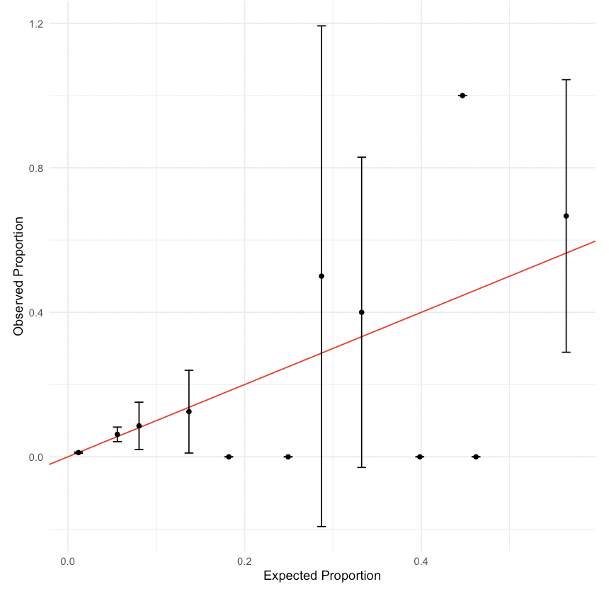

# 11. Logistic Regression

This chapter will build on the last and continue with regression analysis in R. Specifically, we will cover binary logistic regression using the `glm()` function, which can be used to fit generalized linear models. Many of the functions learned in the last chapter can also be used with a `glm` object. For example, the `glm()` function expects a formula in the same way as the `lm()` function. We will also cover diagnostic plots and model evaluation specific to a binary outcome. 

The data used in this chapter is from the 2021 National Youth Tobacco Survey (NYTS). This dataset contains 20,413 participants and a set of variables relating to demographic information, frequency of tobacco use, and methods of obtaining said tobacco as reported by students on the 2021 NYTS. We will use logistic regression to examine whether survey setting was associated with youth reporting of current tobacco use similar to the analysis presented in [Park-Lee et al. (2023). Impact of Survey Setting on Current Tobacco Product Use: National Youth Tobacco Survey, 2021. Journal of Adolescent Health, 72(3), 365-374](https://pubmed.ncbi.nlm.nih.gov/36470692/). Note that we ignore survey weights for this analysis. 

We will use the `broom` package again to present the estimated coefficients, the `tidyverse` package to create a calibration plots, the `lmtest` package to perform likelihood ratio tests, and the `pROC` package to create receiver operating characteristic curves. 

```{r}
suppressPackageStartupMessages(library(broom))
suppressPackageStartupMessages(library(tidyverse))
suppressPackageStartupMessages(library(pROC))
suppressPackageStartupMessages(library(lmtest))
library(HDSinRdata)
data(nyts)
```

## Generalized Linear Models in R

The `glm(formula, data, family)` function in R is used to fit generalized linear models. The three main arguments we must specify to the function are the

* `formula` - specifies the relationship between the independent variables and the outcome of interest,  
* `data` - the dataset used to train the model, and  
* `family` - a description of the error distribution and link function to be used in the model.  

In binary logistic regression, we assume a binomial outcome and use the logit link function. We can specify this by setting `family = binomial`. By default, this will assume the link function is the logit function. Note that we can even use the `glm()` function to implement linear regression by setting `family = gaussian`. Using our example from [Chapter 10](https://alicepaul.github.io/health-data-science-in-r/book/10_linear_regression.html), running `glm(SBP~LEAD, data = nhanes_df, family= gaussian)` would be equivalent to `lm(SBP~LEAD, data = nhanes_df)`.


Our outcome of interest will be current e-cigarette use, `e_cig_use`, so we need to create this variable from the variables that are currently in the data. We set `e_cig_use` to 0 if the respondent answered that they have not used e-cigarettes in the last 30 days and 1 otherwise. We can see that there are only 1,435 respondents who reported e-cigarette use. This is a low percentage of the overall sample, which will likely impact our results. 

```{r}
nyts$e_cig_use <- as.factor(ifelse(nyts$num_e_cigs==0, "0", "1"))
table(nyts$e_cig_use)
```

Looking at the covariate of interest, survey setting, we can see that there are 85 respondents that took the survey in "Some other place". Since we are interested in the impact of taking the survey at school compared to other settings, we will simplify this variable to have two levels: "school" and "home/other". 

```{r}
table(nyts$location)
nyts$location <- ifelse(nyts$location == "In a school building/classroom",
                        "school", "home/other")
nyts$location <- as.factor(nyts$location)
```

To start, we will create a model to predict e-cigarette use from school setting adjusting for the covariates sex, school level, and race and ethnicity. Note that we specify our formula and data as with the `lm()` function. We then use the `summary()` function again to print a summary of this fitted model. The output is slightly different from an `lm` object. We can see the null and residual deviances are reported along with the AIC. Adding transformations and interactions is equivalent to that in the `lm()` function and is not demonstrated in this chapter.

```{r}
mod_start <- glm(e_cig_use ~ grade + sex + race_and_ethnicity + location,
                 data = nyts, family = binomial)
summary(mod_start)
```

We can use the `tidy()` function from the `broom` package to display the estimated coefficients from the above model. This time we add the `exponentiate = TRUE` argument to exponentiate our coefficients so we can interpret them as estimated change in odds rather than log odds. For example, we can see below that those who answered at school have double the estimated odds of reporting e-cigarette use compared to those who took the survey at home/other, adjusting for grade, sex, and race and ethnicity. 

```{r}
tidy(mod_start, exponentiate=TRUE)
```

### Practice Question

Fit a logistic regression model with cigarette use as the outcome and age, race_and_ethnicity, LGBT, and family_affluence as well as an interaction between family_affluence and race_and_ethnicity as independent variables. Your AIC should be 2430.8.

```{r}
# Insert your solution here:
```

## Residuals, Discrimination, and Calibration

Next, we look at the distribution of the residuals. The `resid()` function can be used to find the residuals again, but this time we might want to specify the Pearson and deviance residuals by specifying the `type` argument. We plot histograms for both of these residual types below. In both plots, we can observe a multi-modal distribution, which reflects the binary nature of our outcome. 

```{r}
par(mfrow=c(1,2))
hist(resid(mod_start, type="pearson"))
hist(resid(mod_start, type="deviance"))
```

To further evaluate the fit of our model, we may want to observe the predicted probabilities. The `predict()` function by default will return the predicted value on the scale of the linear predictors. In this case, that is the predicted log odds. If want to find the predicted probabilities, we can update the argument by specifying `type="response"`. Additionally, we can predict on data not used to train the model by using the argument `newdata`. Note that there are only 18,747 predicted probabilities despite our training data having more observations. This is because the `glm()` function (and `lm()` function) drop any observations with NA values when training. In the last chapter, we omitted incomplete cases prior to analysis so that the predicted probabilities corresponded directly to the rows in our data. 

```{r}
pred_probs <- predict(mod_start, type="response")
length(pred_probs)
```

If want to find the class for each observation used in fitting the model, we can use the model's output, which stores the model matrix `x` and the outcome vector `y`. We plot the distribution of estimated probabilities for each class. Note that all the predicted probabilities are below 0.5, the typical cut-off for prediction. This is in part due to the fact that we have such an imbalanced outcome. 

```{r}
ggplot() + 
  geom_histogram(aes(x=pred_probs, fill=as.factor(mod_start$y)),
                bins=30) +
  scale_fill_discrete(name="E-Cig Use") + 
  labs(x="Predicted Probabilities", y="Count")
```

### Receiver Operating Characteristic (ROC) Curve

We now plot the receiver operating characteristic (ROC) curve and compute the area under the curve (AUC). The `roc()` function from the `pROC` package builds an ROC curve. The function has several ways to specify a response and predictor. For example, we can specify the response vector `response` and predictor vector `predictor`. By default, with a 0/1 outcome, the `roc()` function will assume class 0 is controls and class 1 is cases. We can also specify this in the `levels` argument to specify the value of the response for controls and cases, respectively. Additionally, the function assumes the predictor vector specifies predicted probabilities for the class 1. We can change the argument `direction = ">"` if the opposite is true. We can plot the ROC curve by calling the `plot()` function. We can add some extra information by adding the AUC (`print.auc = TRUE`) and the threshold that maximizes sensitivity + specificity (`print.thres = TRUE`). 

```{r}
roc_mod <- roc(predictor=pred_probs, 
               response=as.factor(mod_start$y), 
               levels = c(0,1), direction = "<")
plot(roc_mod, print.auc=TRUE, print.thres = TRUE)
```

If we want to understand more about the curve, we can use the `coords()` function to find the coordinates for each threshold used to create the curve. The argument `x= "all"` specifies we want to find all thresholds, but we could also specify only to return local maxima. 

```{r}
roc_vals <- coords(roc=roc_mod, x = "all")
head(roc_vals)
```

For example, we could use this information to find the highest threshold with a corresponding sensitivity above 0.75. This returns a threshold of 0.062. If we were to predict class 1 for all observations with a predicted probability above 0.062, then we would achieve a sensitivity of 0.77 and specificity of 0.56 on the training data.

```{r}
roc_vals[roc_vals$sensitivity > 0.75, ] %>% tail(n=1)
```

We will use the threshold of 0.080 indicated on our ROC curve to create predicted classes for our response. By comparing the result to our outcome using the `table()` function, we can directly calculate measures like sensitivity, specificity, positive and negative predictive values, and overall accuracy.

```{r}
pred_ys <- ifelse(pred_probs > 0.08, 1, 0)
tab_outcome <- table(mod_start$y, pred_ys)
tab_outcome
```

```{r}
sens <- tab_outcome[2,2]/(tab_outcome[2,1]+tab_outcome[2,2])
spec <- tab_outcome[1,1]/(tab_outcome[1,1]+tab_outcome[1,2])
ppv <- tab_outcome[2,2]/(tab_outcome[1,2]+tab_outcome[2,2])
npv <- tab_outcome[1,1]/(tab_outcome[1,1]+tab_outcome[2,1])
acc <- (tab_outcome[1,1]+tab_outcome[2,2])/sum(tab_outcome)
```

```{r}
data.frame(Measures = c("Sens", "Spec", "PPV", "NPV", "Acc"),
          Values = round(c(sens, spec, ppv, npv, acc),3))
```

### Calibration Plot

Another useful plot is a calibration plot. This type of plot groups the data by the estimated probabilities and compares the mean probability with the observed proportion of observations in class 1. It visualizes how close our estimated distribution and true distribution are to each other. There are several packages that can create calibration plots, but we demonstrate how to do this using the `ggplot2` package. First, we create a data frame with the predicted probabilities and the outcome variable. Additionally, we group this data into `num_cuts` groups based on the predicted probabilities using the `cut()` function. Within each group, we find the model's predicted mean along with the observed proportion and estimated standard errors. 

```{r}
num_cuts <- 10
calib_data <-  data.frame(prob = pred_probs,
                          bin = cut(pred_probs, breaks = num_cuts),
                          class = mod_start$y)
calib_data <- calib_data %>% 
             group_by(bin) %>% 
             summarize(observed = sum(class)/n(), 
                       expected = sum(prob)/n(), 
                       se = sqrt(observed*(1-observed)/n()))
calib_data
```

Next, we plot the observed vs expected proportions. We also used the estimated standard error to create corresponding 95% confidence intervals. The red line indicates a perfect fit where our estimated and true distributions match. Overall, the plot below shows that our model could be better calibrated.

```{r}
ggplot(calib_data) + 
  geom_abline(intercept = 0, slope = 1, color="red") + 
  geom_errorbar(aes(x = expected, ymin=observed-1.96*se, 
                    ymax=observed+1.96*se), 
                colour="black", width=.01)+
  geom_point(aes(x = expected, y = observed)) +
  labs(x="Expected Proportion", y="Observed Proportion") +
  theme_minimal()
```

### Practice Question

Create a calibration plot with 5 cuts for your model from the previous practice question (recall that this model should have cigarette use as the outcome and age, race_and_ethnicity, LGBT, and family_affluence as well as an interaction between family_affluence and race_and_ethnicity as independent variables). It should look like this:



```{r}
# Insert your solution here:
```

## Variable Selection and Likelihood Ratio Tests

In the last chapter, we introduced the `step()` function to implement stepwise variable selection. This function also works with `glm` objects. In this case, we use this function to implement backward selection from a larger set of covariates. We first remove any observations with NA values to ensure that our training data does not change size as the formula changes. 

```{r}
nyts_sub <- nyts %>% 
  dplyr::select(location, sex, grade, otherlang, grades_in_past_year, 
                perceived_e_cig_use, race_and_ethnicity, LGBT, 
                psych_distress, family_affluence, e_cig_use) %>%
  na.omit()
head(nyts_sub)
```

To implement backward selection, we first create a model with all the covariates included. The period `.` in the formula indicates that we want to include all variables. Next, we use the `step()` function. Since we are using backward selection, we only need to specify the lower formula in the scope. 

```{r}
model_full <- glm(e_cig_use ~ ., data = nyts_sub, family = binomial)
mod_step <- step(model_full, direction = 'backward', 
                 scope = list(lower = "e_cig_use ~ sex + grade + 
                 race_and_ethnicity + location"))
```

Stepwise selection keeps most variables in the model and only drops family affluence. Below, we can see the AUC for this model has improved to 0.818.

```{r}
roc_mod_step <- roc(predictor=predict(mod_step, type="response"), 
                    response=as.factor(mod_step$y), 
                    levels = c(0,1), direction = "<")
plot(roc_mod_step, print.auc=TRUE, print.thres = TRUE)
```

If we want to compare this model to our model above, we could use a likelihood ratio test since the two models are nested. The `lrtest()` function from the `lmtest` package allows us to input two nested `glm` models and performs a corresponding Chi-squared likelihood ratio test. First, we need to ensure that our initial model is fit on the same data used in the stepwise selection. The output below indicates a statistically significant improvement in the model likelihood with the inclusion of the other variables. 

```{r}
mod_start2 <- glm(e_cig_use ~ grade + sex + race_and_ethnicity + location,
                 data = nyts_sub, family = binomial)
```

```{r}
print(lrtest(mod_start2, mod_step))
```

## Extending Beyond Binary Outcomes

The `glm()` function can be used to fit models for other possible families and non-binary outcomes. For example, we can fit models where the outcome might follow a Poisson distribution or negative binomial distribution by updating the `family` argument. Below, we fit a Poisson model to model the number of e-cigarettes used in the last 30 days by setting `family = poisson`. However, despite the fact that our outcome is a count value, this model doesn't seem to be a good fit for our data. 

```{r}
mod_poisson <- glm(num_e_cigs ~ grade + sex + race_and_ethnicity + location,
                 data = nyts, family = poisson)
```

```{r}
par(mfrow=c(1,2))
hist(predict(mod_poisson, type="response"), main="Model", xlab="Predicted Values")
hist(nyts$num_e_cigs, main="Observed", xlab="Number E-Cigs")
```

## Recap Video


<div class="video-container">
    <iframe width="700" height="500" src="https://www.youtube.com/embed/0D8Nul44eYQ" title="YouTube video player" frameborder="0" allow="accelerometer; autoplay; clipboard-write; encrypted-media; gyroscope; picture-in-picture; web-share" allowfullscreen></iframe>
</div>

## Exercises

1. Create a new variable `tobacco_use` representing any tobacco use in the past 30 days (including e-cigs, cigarettes, and/or cigars) as well as a new variable `perceived_tobacco_use` equal to the maximum of the perceived cigarette and e-cig use. Then, create a new data frame `nyts_sub` that contains these two new columns as well as columns for sex, grades in the past year, psych distress, and family affluence. Finally, fit a logistic regression model with this new tobacco use variable as the outcome and all other selected variables as independent variables.

2. Perform stepwise selection on your model from Question 1 with `direction = "both"`, setting the upper scope of the model selection procedure to be a model including all two-way interactions and the lower scope to be a model including only an intercept. To specify all possible interactions you can use the formula `"tobacco_use ~ .^2"`. Use the `tidy()` function to display the exponentiated estimated coefficients for the resulting model along with a confidence interval.   

3. According to your model from Question 2, what is the estimated probability of tobacco use for a girl with mostly C's, moderate psych distress, and a perceived tobacco use of 0.5? Use the `predict()` function to answer this question.

4. Construct an ROC curve for the model from Question 2 and find the AUC as well as the threshold that maximizes sensitivity and specificity.

