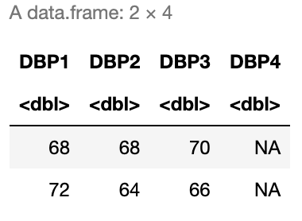

# 5. Data Transformations and Summaries

In this chapter, we will introduce the `dyplr` package, which is part of the `tidyverse` group of packages, to expand our tools in exploring and transforming our data. We will learn how to do some basic manipulations of data (e.g. adding or removing columns, filtering data, arranging by one or multiple columns) as well as how to summarize data (e.g. grouping by values, calculating summary statistics). We will also practice combining these operations using the pipe operator `%>%`. We will use the same sample of the National Health and Nutrition Examination Survey ([NHANES](https://www.cdc.gov/nchs/nhanes/index.htm)) as in [Chapter 4](https://alicepaul.github.io/health-data-science-in-r/book/4_exploratory_analysis.html).

```{r}
suppressPackageStartupMessages(library(HDSinRdata))
suppressPackageStartupMessages(library(tidyverse))
data(NHANESsample)
```

## Tibbles and Data Frames

Take a look at the class of `NHANESsample`. As we might expect, the data is stored as a data frame.  

```{r}
class(NHANESsample)
```

However, the tidyverse also works with another data structure called a **tibble**. A **tibble** has all the properties of data frames that we have learned so far, but they are a more modern version of a data frame. To convert our data to this data structure we use the `as_tibble()` function. In practice, there are only very slight difference between the two data structures, and you generally do not need to convert data frames to tibbles. Below we convert our data from a data frame to a tibble and print the head of the data before converting it back to a data frame and repeating. You can see the two structures have a slightly different print statement but are otherwise very similar.

```{r}
nhanes_df <- as_tibble(NHANESsample)
print(head(nhanes_df))
```

```{r}
nhanes_df <- as.data.frame(nhanes_df)
print(head(nhanes_df))
```

We mention tibbles here since some functions in the `tidyverse` package convert data frames to tibbles in their output. In particular, when we summarize over groups below we can expect a tibble to be returned. It is useful to be aware that our data may change data structure with such functions and to know that we can always convert back if needed. 

## Subsetting Data 

In earlier chapters, we have seen how to select and filter data using row and column indices as well as using the `subset()` function. The `dplyr` package has its own functions that are useful to subset the data. The `select()` function allows us to select a subset of columns: this function takes in the data frame (or tibble) and the names or indices of the columns we want to select. For example, if we only wanted to select the variables for race and blood lead level, we could specify these two columns. To display the result of this selection, we use the pipe operator `%>%`. Recall that this takes the result on the left hand side and passes it as the first argument to the function on the right hand side. The output below shows that there are only two columns in the filtered data.  

```{r}
select(nhanes_df, c(RACE, LEAD)) %>% head()
```

The `select()` function can also be used to *remove* columns by adding a negative sign in front of the vector of column names in its arguments. For example, below we keep all columns except `ID` and `LEAD_QUANTILE`. Note that in this case we have saved the selected data back to our data frame `nhanes_df`. Additionally, this time we used a pipe operator to pipe the data to the select function itself.

```{r}
nhanes_df <- nhanes_df %>% select(-c(ID, LEAD_QUANTILE))
names(nhanes_df)
```

While `select()` allows us to choose a subset of columns, the `filter()` function allows us to choose a subset of rows.  The `filter()` function takes a data frame as the first argument and a vector of booleans as the second argument. This vector of booleans can be generated using conditional statements as we used in [Chapter 4](https://alicepaul.github.io/health-data-science-in-r/book/4_exploratory_analysis.html). Below, we choose to filter the data to only observations after 2008.

```{r}
nhanes_df_recent <- nhanes_df %>% filter(YEAR >= 2008)
```

We can combine conditions by using multiple `filter` calls, by creating a more complicated conditional statement using the `&` (and), `|` (or), and `%in%` (in) operators, or by separating the conditions with commas within filter. Below, we demonstrate these three ways to filter the data to males between 2008 and 2012. Note that the `between()` function allows us to capture the logic `YEAR >= 2008 & YEAR <= 2012`. 

```{r}
# Example 1: multiple filter calls
nhanes_df_males1 <- nhanes_df %>%
  filter(YEAR <= 2012) %>%
  filter(YEAR >= 2008) %>%
  filter(SEX == "Male")

# Example 2: combine with & operator
nhanes_df_males2 <- nhanes_df %>%
  filter((YEAR <= 2012) & (YEAR >= 2008) & (SEX == "Male"))

# Example 3: combine into one filter call with commas
nhanes_df_males3 <- nhanes_df %>%
  filter(between(YEAR, 2008, 2012), SEX == "Male")
```

The use of parentheses in the code above is especially important in order to capture our desired logic. In all these examples, we broke our code up into multiple lines, which makes it easier to read. A good rule of thumb is to not go past 80 characters in a line, and R Studio conveniently has a vertical gray line at this limit. To create a new line, you can hit enter either after an operator (e.g. `%>%`, `+`, `|`) or within a set of unfinished brackets or parentheses. Either of these breaks lets R know that your code is not finished yet. 

Lastly, we can subset the data using the `slice()` function to select a slice of rows by their index. The function takes in the data set and a vector of indices. Below, we find the first and last rows of the data. 

```{r}
slice(nhanes_df, c(1, nrow(nhanes_df)))
```

A few other useful slice functions are `slice_sample()`, `slice_max()`, and `slice_min()`. The first takes in an argument `n` which specifies the number of *random* rows to sample from the data. For example, we could randomly sample 100 rows from our data. The latter two allow us to specify a column through the argument `order_by` and return the `n` rows with either the highest or lowest values in that column. Below we find the three male observations from 2007 with the highest and lowest blood lead levels and select a subset of columns to display.

```{r}
# three male observations with highest blood lead level in 2007
nhanes_df %>%
  filter(YEAR == 2007, SEX == "Male") %>%
  select(c(RACE, EDUCATION, SMOKE, LEAD, SBP1, DBP1)) %>%
  slice_max(order_by = LEAD, n=3)

# three male observations with lowest blood lead level in 2007
nhanes_df %>%
  filter(YEAR == 2007, SEX == "Male") %>%
  select(c(RACE, EDUCATION, SMOKE, LEAD, SBP1, DBP1)) %>%
  slice_min(order_by = LEAD, n=3)
```

### Practice Question

Filter the data to only those with an education level of more than HS who report alcohol use. Then, select only the diastolic blood pressure variables and display the 4th and 10th rows. Your result should match the data below.



```{r}
# Insert your solution here:
```

## Updating Rows and Columns

The next few functions we will look at will allow us to update the rows and columns in our data. For example, the `rename()` function allows us to change the names of columns. Below, we change the name of `INCOME` to `PIR` since this variable is the poverty income ratio and also update the name of `SMOKE` to be `SMOKE_STATUS`. When specifying these names, the new name is on the left of the `=` and the old name is on the right.

```{r}
nhanes_df <- nhanes_df %>% rename(PIR = INCOME, SMOKE_STATUS = SMOKE)
names(nhanes_df)
```

In the last chapter, we created a new variable called `EVER_SMOKE` based on the smoking status variable using the `ifelse()` function. Recall that this function allows us to specify a condition and then two alternative values based on whether we meet or do not meet this condition. We see that there are about 15,000 subjects in our data who never smoked. 

```{r}
ifelse(nhanes_df$SMOKE_STATUS == "NeverSmoke", "No", "Yes") %>% table()
```

Another useful function from the tidyverse is the `case_when()` function, which is an extension of the `ifelse()` function but allows to specify more than two cases. We demonstrate this function below to show how we could relabel the levels of the `SMOKE_STATUS` column. For each condition, we use the right side of the `~` to specify the value associated with a TRUE for that condition. 

```{r}
case_when(nhanes_df$SMOKE_STATUS == "NeverSmoke" ~ "Never Smoked",
          nhanes_df$SMOKE_STATUS == "QuitSmoke" ~ "Quit Smoking",
          nhanes_df$SMOKE_STATUS == "StillSmoke" ~ "Current Smoker") %>% table()
```

Above, we did not store the columns we created. To do so, we could use the `$` operator or the  `cbind()` function. The tidyverse also includes an alternative function to add columns called `mutate()`. This function takes in a data frame and a set of columns with associated names to add to the data or update. In the example below, we create the column `EVER_SMOKE` and update the column `SMOKE_STATUS`. Within the `mutate()` function, we do not have to use the `$` operator to reference the column `SMOKE_STATUS`. Instead, we can specify just the column name and it will interpret it as that column.

```{r}
nhanes_df <- nhanes_df %>% 
  mutate(EVER_SMOKE = ifelse(SMOKE_STATUS == "NeverSmoke", "No", "Yes"), 
         SMOKE_STATUS = case_when(SMOKE_STATUS == "NeverSmoke" ~ "Never Smoked",
                                  SMOKE_STATUS == "QuitSmoke" ~ "Quit Smoking",
                                  SMOKE_STATUS == "StillSmoke" ~ "Current Smoker")) 
```

The last function we will demonstrate in this section is the `arrange()` function, which takes in a data frame and a vector of columns used to sort the data (data is sorted by the first column with ties being sorted by the second column, etc.). By default, the `arrange()` function sorts the data in increasing order, but we can use the `desc()` function to instead sort in descending order. For example, the code below filters the data to male smokers before sorting by decreasing systolic and diastolic blood pressure in descending order. 

```{r}
nhanes_df %>% 
  select(c(YEAR, SEX, SMOKE_STATUS, SBP1, DBP1, LEAD)) %>%
  filter(SEX == "Male", SMOKE_STATUS == "Current Smoker") %>%
  arrange(desc(SBP1), desc(DBP1)) %>%
  head(10)
```

### Practice Question

Create a new column called `DBP_CHANGE` that is equal to the difference between a patient's first and fourth diastolic blood pressure readings. Then, sort the data frame by this new column in increasing order and print the first four rows. The first four `DBP_CHANGE` values in the head of the resulting dataset should be -66, -64, -64, and -62.

```{r}
# Insert your solution here:                    
```

## Summarizing and Grouping

If we wanted to understand how many observations there are for each given race category, we could use the `table()` function as we described in earlier chapters. Another similar function is the `count()` function. This function takes in a data frame and one or more columns and counts the number of rows for each combination of unique values in these columns. If no columns are specified, it counts the total number of rows in the data frame. Below, we find the total number of rows (31,265) and the number of observations by race and year. We can see that the number in each group fluctuates quite a bit!

```{r}
count(nhanes_df)
count(nhanes_df, RACE, YEAR)
```

Finding the counts like we did above is a form of a summary statistic for our data. The `summarize()` function in the tidyverse is used to compute summary statistics of the data and allows us to compute multiple statistics: this function takes in a data frame and one or more summary functions based on the given column names. In the example below, we find the total number of observations as well as the mean and median systolic blood pressure for Non-Hispanic Blacks. Note that the `n()` function is the function within `summarize()` that finds the number of observations. In the `mean()` and `median()` functions we set `na.rm=TRUE` to remove NAs before computing these values (otherwise we could get NA as our output).

```{r}
nhanes_df %>%
  filter(RACE == "Non-Hispanic Black") %>%
  summarize(TOT = n(), MEAN_SBP = mean(SBP1, na.rm=TRUE), 
            MEAN_DBP = mean(DBP1, na.rm=TRUE))
```

If we wanted to repeat this for the other race groups, we would have to change the arguments to the `filter()` function each time. To avoid having to repeat our code and/or do this multiple times, we can use the `group_by()` function, which takes a data frame and one or more columns with which to group the data by. Below, we group using the `RACE` variable. When we look at printed output it looks almost the same as it did before except we can see that its class is now a grouped data frame, which is printed at the top. In fact, a grouped data frame (or grouped tibble) acts like a set of data frames: one for each group. If we use the `slice()` function with index 1, it will return the first row for each group.

```{r}
nhanes_df %>% 
  group_by(RACE) %>%
  slice(1)
```

Grouping data is very helpful in combination with the `summarize()` function. Like with the `slice()` function, `summarize()` will calculate the summary values for each group. We can now find the total number of observations as well as the mean systolic and diastolic blood pressure values for each racial group. Note that the returned summarized data is in a tibble. 

```{r}
nhanes_df %>% 
  group_by(RACE) %>%
  summarize(TOT = n(), MEAN_SBP = mean(SBP1, na.rm=TRUE), 
            MEAN_DBP = mean(DBP1, na.rm=TRUE))
```

After summarizing, the data is no longer grouped by race. If we ever want to remove the group structure from our data, we can use the `ungroup()` function, which restores the data to a single data frame. After ungrouping by race below, we can see that we get a single observation returned by the `slice()` function.

```{r}
nhanes_df %>% 
  select(SEX, RACE, SBP1, DBP1) %>%
  group_by(RACE) %>%
  ungroup() %>%
  arrange(desc(SBP1)) %>%
  slice(1)
```

### Practice Question

Create a data frame summarizing the percent of patients with hypertension by smoking status. The result should look like this: 


```{r}
# Insert your solution here:
```

## Recap Video

<div class="video-container">
    <iframe width="700" height="500" src="https://www.youtube.com/embed/IeRMFCCuxwc" title="YouTube video player" frameborder="0" allow="accelerometer; autoplay; clipboard-write; encrypted-media; gyroscope; picture-in-picture; web-share" allowfullscreen></iframe>
</div>

## Exercises

The following exercises use the `covidcases` dataset from the `HDSinRdata` package. Before completing the exercises, be sure to read the documentation for this data (`?covidcases`).

```{r}
data(covidcases)
```

1. Suppose we are interested in the distribution of weekly cases by state. First, create a new column in `covidcases` called `region` specifying whether each state is in the Northeast, Midwest, South, or West (you can either do this by hand using [this list](https://en.wikipedia.org/wiki/List_of_regions_of_the_United_States) of which states are in which region or you can use [state.region](https://search.r-project.org/CRAN/refmans/usa/html/state.region.html) from the `datasets` package in R). Then, create a data frame summarizing the average and standard deviation of the weekly cases for the Northeast. 

2. Now, create a data frame with the average and standard deviation summarized for each region rather than for just one selected region as in Question 1. Sort this data frame from highest to lowest average weekly cases. What other information would you need in order to more accurately compare these regions in terms of their average cases?

3. Find the ten counties in the Midwest with the lowest weekly deaths in week 15 of this data ignoring ties (use `?slice_min` to find the argument needed for this). What do you notice about the minimum values? See the data documentation for why we observe these values. 

4. Filter the data to between weeks 9 and 20 (around the start of the pandemic), get the total cases per county during that time frame, and then find the county in each state that had the highest number of total cases. 

