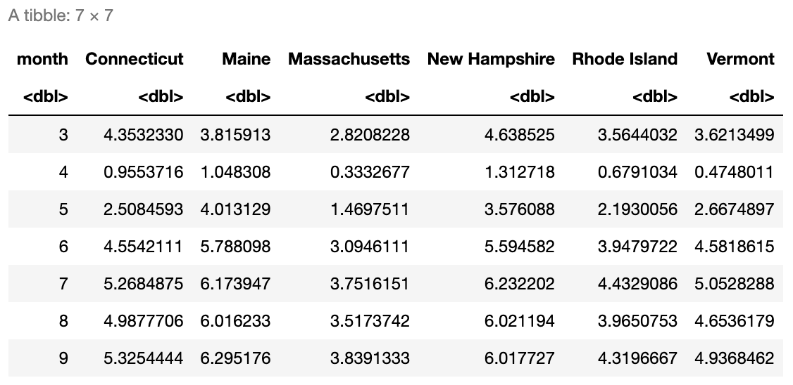

# 6. Merging and Reshaping Data

In this chapter, we continue to look at some of the ways to manipulate data using the tidyverse packages. In particular, we will look at reshaping and merging data frames in order to get the data in the format we want. When reshaping data, we can convert between *wide form* (more columns, fewer rows) and *long form* (fewer columns, more rows). We can also use data pivots to put our data into what is called *tidy form*. Additionally, we will look at combining information from multiple data frames into a single data frame. The key ideas when merging data are to think about what the common information is between the data frames and to consider which values we want to keep. 

For this chapter, we will use three data sets. The first data set is `covidcases`, which contains the weekly case and death counts by county in the United States for 2020; the second data set is `mobility`, which contains daily mobility estimates by state in 2020; and the third data set is `lockdowndates`, which contains the start and end dates for statewide stay at home orders. Take a look at the first few rows of each data frame below and read the documentation for the column descriptions.

```{r}
suppressPackageStartupMessages(library(tidyverse))
suppressPackageStartupMessages(library(HDSinRdata))
data(covidcases)
data(lockdowndates)
data(mobility)
```

```{r}
head(covidcases)
```

```{r}
head(mobility)
```

```{r}
head(lockdowndates)
```

Both the mobility and lockdown data frames contain date columns. Right now, these columns in both data sets are of the class character, which we can see in the printed output above. We can use the `as.Date()` function to tell R to treat these columns as dates instead of characters. When using this function, we need to specify the date format as an argument so that R knows how to parse this text to a date. Our format is given as `%Y-%M-%D`, where the `%Y` stands for the full four-digit year, `%M` is a two-digit month (e.g. January is coded "01" vs "1"), and `%D` stands for the two-digit day (e.g. the third day is coded "03" vs "3"). Below, we convert the classes of these columns to 'Date'. 

```{r}
mobility$date <- as.Date(mobility$date, formula="%Y-%M-%D")
lockdowndates$Lockdown_Start <- as.Date(lockdowndates$Lockdown_Start, formula="%Y-%M-%D")
lockdowndates$Lockdown_End <- as.Date(lockdowndates$Lockdown_End, formula="%Y-%M-%D")
class(mobility$date)
class(lockdowndates$Lockdown_Start)
class(lockdowndates$Lockdown_End)
```

After coding these columns as dates, we can access information such as the day, month, year, or week from them. These functions are all available in the `lubridate` package, which is a package in the tidyverse that allows us to manipulate dates. 

```{r}
month(mobility$date[1])
week(mobility$date[1])
```

Next, we add a date column to `covidcases`. In this case, we need to use the week number to find the date. Luckily, we can add days, months, weeks, or years to dates in the `lubridate` package. January 1, 2020 was a Wednesday and is counted as the first week, so to find the corresponding Sunday for each week, we add the recorded week number minus one to December 29, 2019 (the last Sunday before 2020). We show a simple example of adding one week to this date below before doing this conversion for the entire column.

```{r}
as.Date("2019-12-29")+weeks(1)
```

```{r}
covidcases$date <- as.Date("2019-12-29")+weeks(covidcases$week-1)
head(covidcases)
```

## Tidy Data 

The tidyverse is designed around interacting with **tidy data** with the premise that using data in a tidy format can streamline our analysis. Data is considered **tidy** if

1.  Each variable is associated with a single column.
2.  Each observation is associated with a single row.
3.  Each value has its own cell.

Take a look at the sample data below which stores information about the maternal mortality rate for five countries over time (source: https://ourworldindata.org/maternal-mortality). This data is *not* tidy because the variable for maternity mortality rate is associated with multiple columns. Every row should correspond to one class observation.

```{r}
mat_mort1 <- data.frame(country = c("Turkey", "United States", "Sweden", "Japan"),
                       y2002 = c(64, 9.9, 4.17, 7.8),
                       y2007 = c(21.9, 12.7, 1.86, 3.6),
                       y2012 = c(15.2, 16, 5.4, 4.8))
head(mat_mort1)
```

However, we can make this data tidy by creating separate columns for country, year, and maternity mortality rate as we demonstrate below. Now every observation is associated with an individual row. 

```{r}
mat_mort2 <- data.frame(
    country = rep(c("Turkey", "United States", "Sweden", "Japan"), 3),
    year = c(rep(2002, 4), rep(2007, 4), rep(2012, 4)),
    mat_mort_rate = c(64.0, 9.9, 4.17, 7.8, 21.9, 12.7, 1.86, 3.6, 
                      15.2, 16, 5.4, 4.8))
head(mat_mort2)
```

## Reshaping Data

The mobility and covid case data are both already in tidy form - each observation corresponds to a single row and every column is a single variable. We might consider whether the lockdown dates should be reformatted to be tidy. Another way to represent this data would be to have each observation be the start or end of a stay at home order. 

To reshape our data, we use the `pivot_longer()` function to change the data from what is called **wide form** to what is called **long form**. This kind of pivot involves taking a subset of columns that we will *gather* into a single column while increasing the number of rows in the data set. Before pivoting, we have to think about which columns we are transforming. The image below shows a picture of some data on whether students have completed a physical, hearing, or eye exam. The data is presented in wide form on the left and long form on the right. To transform wide data to long data, we have identified a subset of columns `cols` that we want to transform (these `cols` are shown in light purple on the left). The long form contains a new column `names_to` that contains the exam type and `values_to` that contains a binary variable indicating whether or not each exam was completed. 


In our case, we want to take the lockdown start and end columns and create two new columns: one column will indicate whether or not a date represents the start or end of a lockdown, and the other will contain the date itself. These are called the *key* and *value* columns, respectively. The key column will get its values from the names of the columns we are transforming (or the keys) whereas the value column will get its values from the entries in those columns (or the values). 

The `pivot_longer()` function takes in a data table, the columns `cols` that we are pivoting to longer form, the column name `names_to` that will store the data from the previous column names, and the column name `values_to` for the column that will store the information from the columns gathered. In our case, we will name the first column `Lockdown_Event` since it will contain whether each date is the start or end of a lockdown, and we will name the second column `Date`. Take a look at the result below.

```{r}
lockdown_long <- lockdowndates %>%
  pivot_longer(cols=c("Lockdown_Start", "Lockdown_End"), 
               names_to="Lockdown_Event", values_to="Date") %>%
  mutate(Date = as.Date(Date, formula ="%Y-%M-%D"), 
         Lockdown_Event = ifelse(Lockdown_Event=="Lockdown_Start", 
                                 "Start", "End")) %>%
  na.omit()
head(lockdown_long)
```

In R, we can also transform our data in the opposite direction (from long form to wide form instead of from wide form to long form)  using the function `pivot_wider()`. This function again first takes in a data table but now we specify the arguments `names_from` and `values_from`. The former indicates the column that R should get the new column names from, and the latter indicates where the row values should be taken from. For example, in order to pivot our lockdown data back to wide form below, we specify that `names_from` is the lockdown event and `values_from` is the date itself. Now we are back to the same form as before!

```{r}
lockdown_wide <- pivot_wider(lockdown_long, names_from=Lockdown_Event, 
                             values_from=Date)
head(lockdown_wide)
```

Here's another example: suppose that I want to create a data frame where the columns correspond to the number of cases for each state in New England and the rows correspond to the numbered months. First, I need to filter my data to New England and then summarize my data to find the number of cases per month. I use the `month()` function to be able to group by month and state. Additionally, you can see that I add an `ungroup()` at the end. When we summarize on data grouped by more than one variable, the summarized output will still be grouped. In this case, the warning message states that the data is still grouped by state.

```{r}
ne_cases <- covidcases %>% 
  filter(state %in% c("Maine", "Vermont", "New Hampshire", "Connecticut", "Rhode Island",
                                  "Massachusetts")) %>%
  mutate(month = month(date)) %>%
  group_by(state, month) %>%
  summarize(total_cases = sum(weekly_cases)) %>%
  ungroup()
head(ne_cases)
```

Now, I need to convert this data to wide format with a column for each state, so my `names_from` argument will be `state`. Further, I want each row to have the case values for each state, so my `values_from` argument will be `total_cases`. The format of this data may not be tidy, but it allows me to quickly compare cases across states.

```{r}
pivot_wider(ne_cases, names_from=state, values_from=total_cases)
```

### Practice Question 

Create a similar data frame as we did above but this time using the `mobility` dataset. In other words, create a data frame where the columns correspond to the average mobility for each state in New England and the rows correspond to the numbered months. You should get a result that looks like this:



```{r}
# Insert your solution here:
```

The pivots above were relatively simple in that there was only one set of values we were pivoting on (e.g. the lockdown date, covid cases). The [`tidyr` package](https://tidyr.tidyverse.org/articles/pivot.html) provides examples of more complex pivots that you might want to apply to your data. In the video below, we demonstrate a pivot longer when there is information in the column names, a pivot wider with multiple value columns, and a pivot longer with many variables in the columns.

### Pivot Video


<div class="video-container">
    <iframe width="700" height="500" src="https://www.youtube.com/embed/X4JnidcfUJw" title="YouTube video player" frameborder="0" allow="accelerometer; autoplay; clipboard-write; encrypted-media; gyroscope; picture-in-picture; web-share" allowfullscreen></iframe>
</div>

## Merging Data with Joins

Above, we saw how to manipulate our current data into new formats. Now, we will see how we can combine multiple data sources. Merging two data frames is called *joining*, and the functions we will use to perform this joining depends on how we want to match values between the data frames. For example, below we join information about age and statin use from `table1` and `table2` matching by name.

```{r}
table1 <- data.frame(age = c(14, 26, 32), name = c("Alice", "Bob", "Alice"))
table2 <- data.frame(name = c("Carol", "Bob"), statins = c(TRUE, FALSE))
full_join(table1, table2, by = "name")
```

The list below shows an overview of the different possible joins, and the video talks through each join type. For each join type, we specify two tables, `table1` and `table2`, and the `by` argument, which specifies the columns used to match rows between tables. 

**Types of Joins**:

* `left_join(table1, table2, by)`: Joins each row of table1 with all matches in table2.  
*  `right_join(table1, table2, by)`: Joins each row of table2 with all matches in table1 (the opposite of a left join)  
* `inner_join(table1, table2, by)`: Looks for all matches between rows in table1 and table2. Rows that do not find a match are dropped.  
* `full_join(table1, table2, by)`: Keeps all rows from both tables and joins those that match. Rows that do not find a match will have NA values filled in.  
* `semi_join(table1, table2, by)`: Keeps all rows in table1 that have a match in table2 but does not join to any information from table2.  
* `anti_join(table1, table2, by)`: Keeps all rows in table1 that *do not* have a match in table 2 but does not join to any information from table2. The opposite of a semi join.  

### Types of Joins Video

<div class="video-container">
    <iframe width="700" height="500" src="https://www.youtube.com/embed/slazeLLQBoY" title="YouTube video player" frameborder="0" allow="accelerometer; autoplay; clipboard-write; encrypted-media; gyroscope; picture-in-picture; web-share" allowfullscreen></iframe>
</div>

We will first demonstate a left join using the `left_join()` function. This function takes in two data tables (table1 and table 2) and the columns to match rows by. In a left join, for every row of table1, we look for all matching rows in table2 and add any columns not used to do the matching. Thus, every row in table1 corresponds to at least one entry in the resulting table but possibly more if there are multiple matches. Below, we use a left join to add the lockdown information to our `covidcases` data. In this case, the first table will be `covidcases` and we will match by `state`. Since the state column has a slightly different name in the two data frames ("state" in `covidcases` and "State" in `lockdowndates`), we specify that `state` is equivalent to `State` in the `by` argument.

```{r}
covidcases_full <- left_join(covidcases, lockdowndates, by=c("state"="State"))
head(covidcases_full)
```

These two new columns will allow us to determine whether the start of each recorded week was during a lockdown. We use the `between` function to create a new column `lockdown` before dropping the two date columns. We can check that this column worked as expected by choosing a single county to look at. 

```{r}
covidcases_full <- covidcases_full %>%
  mutate(lockdown = between(date, Lockdown_Start, Lockdown_End)) %>%
  select(-c(Lockdown_Start, Lockdown_End)) 
covidcases_full %>%
  filter(state == "Alabama", county == "Jefferson", date <= as.Date("2020-05-10"))
```

We now want to add in the mobility data. In the join above, we wanted to keep any observation in `covidcases` regardless if it was in the `lockdowndates` data frame. Therefore, we used a left join. In this case, we will only want to keep observations that have mobility date for that state on each date. This indicates that we want to use an *inner join*. The function `inner_join()` takes in two data tables (table1 and table2) and the columns to match rows by. The function only keeps rows in table1 that match to a row in table2. Again, those columns in table2 not used to match with table1 are added to the resulting outcome. In this case, we match by both state and date.

```{r}
covidcases_full <- inner_join(covidcases_full, mobility, by = c("state", "date")) %>%
  select(-c(samples, m50_index))
head(covidcases_full)
```

### Practice Question

Look at the two data frames, df_A and df_B, created in the below code. What kind of join would produce the following data frame? Perform this join yourself.


```{r}
df_A <- data.frame(patient_id = c(12, 9, 12, 8, 14, 8), 
                  visit_num = c(1, 1, 2, 1, 1, 2), 
                  temp = c(97.5, 96, 98, 99, 102, 98.6), 
                  systolic_bp = c(120, 138, 113, 182, 132, 146))
df_A
df_B <- data.frame(patient_id = c(12, 12, 12, 8, 8, 8, 14, 14), 
                   visit_num = c(1, 2, 3, 1, 2, 3, 1, 2),
                   digit_span = c(3, 5, 7, 7, 9, 5, 8, 7))
df_B
```

```{r}
# Insert your solution here:
```

## Exercises

1. Take a look at the code below - what is wrong with it? Hint: think about what causes the warning message. 

```{r}
visit_info <- data.frame(
  name.f = c("Phillip", "Phillip", "Phillip", "Jessica", "Jessica"),
  name.l = c("Johnson", "Johnson", "Richards", "Smith", "Abrams"),
  measure = c("height", "age", "age", "age", "height"),
  measurement = c(45, 186, 50, 37, 156)
)

contact_info <- data.frame(
first_name = c("Phillip", "Phillip", "Jessica", "Margaret"),
last_name = c("Richards", "Johnson", "Smith", "Reynolds"),
email = c("pr@aol.com", "phillipj@gmail.com", "jesssmith@brown.edu", "marg@hotmail.com")
)

left_join(visit_info, contact_info, by = c("name.f" = "first_name"))
```

2. First, use the `covidcases` data to create a new data frame called `sub_cases` containing the total number of cases by month for the states of California, Michigan, Connecticut, Rhode Island, Ohio, New York, and Massachusetts. Then, manipulate the `mobility` data to calculate the average `m50` mobility measure for each month. Finally, merge these two data sets using an appropriate joining function.

3. Convert the `sub_cases` data frame from the previous exercise to wide format so that each row displays the cases in each state for a single month. Then, add on the average m50 overall for each month as an additional column using  a join function. 

